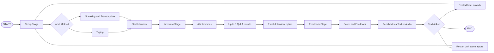

## 🎙️ Streamlit Interview Bot
## A conversational AI interview coach that helps you prepare for your next big job opportunity. Built with Python, Streamlit, and the power of OpenAI's language and speech models.

 


Streamlit page - https://chatbots-interview.streamlit.app/

## Features

-   Voice and text input
-   AI-powered questions
-   Interview performance feedback

Easy to Use: A simple, interactive interface to guide you through the process.


 ## User Flow

This diagram illustrates the user's journey through the application.




# 🤖 Interview Bot – Flow Overview


---

## 🟦 SETUP STAGE
- User provides personal info:
  - **Name**
  - **Experience**
  - **Skills**
  - **Company + Position**
  - *(Optional)* Job post description
- Info can be entered by:
  - Typing ✍️
  - Speaking 🎙️ (voice recorded + transcribed)
- Once all info is given → **Start Interview**


---

## 🟩 INTERVIEW STAGE
- AI Interviewer introduces itself
- **5 Question/Answer rounds**:
  - AI asks a question (text + audio 🔊)
  - User answers (text or voice 🎤)
  - AI responds with a follow-up
- User can also finish early → **Finish Interview**


---

## 🟨 FEEDBACK STAGE
- AI evaluates performance:
  - Gives **Score (1–10)**
  - Provides **Feedback summary**
- Feedback is available as:
  - Text 📄
  - Audio (autoplay 🔊)
- User options after feedback:
  - 🔄 Restart interview from scratch
  - ✏️ Restart with same inputs (edit details)


### 🛠️ Installation

#### Prerequisites
* Python 3.8+
* An **OpenAI API key**. You'll need to set this up as a Streamlit secret.

#### Setup Steps
1.  **Clone the Repository** (or save the code to a file named `app.py`).

2.  **Install Required Libraries**: Open your terminal or command prompt and run the following command to install the necessary Python packages.
    ```bash
    pip install streamlit openai streamlit-js-eval streamlit-mic-recorder
    ```

3.  **Set Up OpenAI API Key**: Create a folder named `.streamlit` in the same directory as your `app.py` file. Inside this folder, create a file named `secrets.toml` and add your OpenAI API key in the following format:
    ```toml
    [OPENAI_API_KEY]
    OPENAI_API_KEY = "your_api_key_here"
    ```
    Remember to replace `"your_api_key_here"` with your actual key.

---

### 🚀 How to Run

1.  Open your terminal or command prompt.
2.  Navigate to the directory where you saved the `app.py` file.
3.  Run the application using the Streamlit command:
    ```bash
    streamlit run app.py
    ```
4.  The application will open automatically in your default web browser.

---

